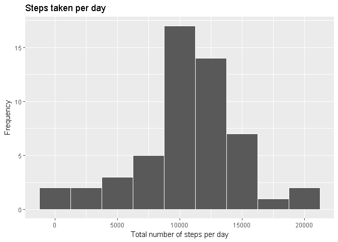
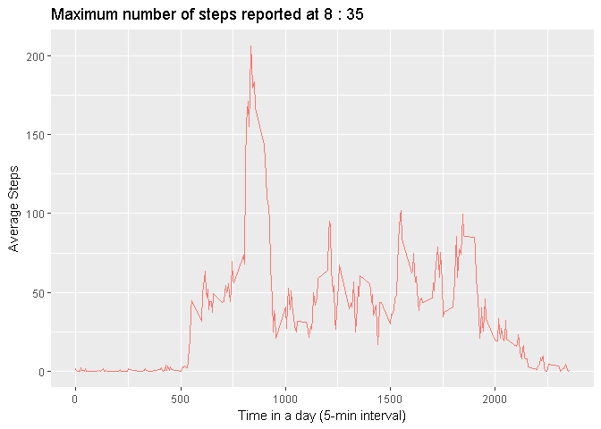
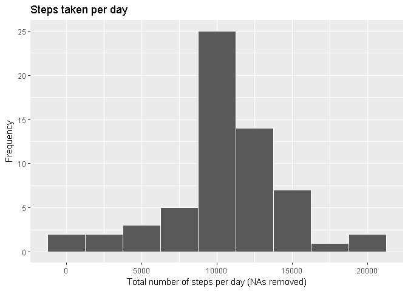
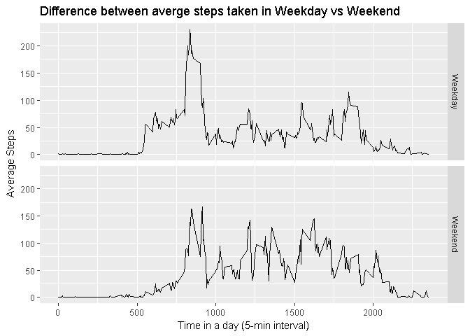

# Reproducible Research: Peer Assessment 1


## Loading and preprocessing the data

```r
library(dplyr)
```

```
## 
## Attaching package: 'dplyr'
```

```
## The following objects are masked from 'package:stats':
## 
##     filter, lag
```

```
## The following objects are masked from 'package:base':
## 
##     intersect, setdiff, setequal, union
```

```r
library(ggplot2)
unzip("activity.zip")
activityData<-read.csv("activity.csv")
str(activityData)
```

```
## 'data.frame':	17568 obs. of  3 variables:
##  $ steps   : int  NA NA NA NA NA NA NA NA NA NA ...
##  $ date    : Factor w/ 61 levels "2012-10-01","2012-10-02",..: 1 1 1 1 1 1 1 1 1 1 ...
##  $ interval: int  0 5 10 15 20 25 30 35 40 45 ...
```


## What is mean total number of steps taken per day?

```r
activityByDay<-group_by(select(activityData,date,steps),date)
stepsPerDay<-summarise(activityByDay,sum(steps))

names(stepsPerDay)[2]<-"total.steps"

g<-ggplot(stepsPerDay,aes(total.steps))
g<-g+geom_histogram(binwidth = 2500,col="white")
g<-g+ggtitle("Steps taken per day")
g<-g+labs(y="Frequency",x = "Total number of steps per day")
print(g)
```

<!-- -->

```r
meanStepsPerDay<-mean(stepsPerDay$total.steps,na.rm=TRUE)
medianStepsPerDay<-median(stepsPerDay$total.steps,na.rm=TRUE)
```

* Mean number of steps taken per day - ``10766``        
* Median number of steps per day - ``10765``  


## What is the average daily activity pattern?


```r
stepsByTime<-group_by(select(activityData,interval,steps),interval)
stepsByTime<-summarise(stepsByTime,mean(steps,na.rm=TRUE))

names(stepsByTime)<-c("Interval","Average.Steps")

timeMin<-stepsByTime$Interval%%100
timeHour<-floor(stepsByTime$Interval/100)
stepsByTime$timeOfDay<-paste(timeHour,":",timeMin)

timeAtmax<-stepsByTime[stepsByTime$Average.Steps==max(stepsByTime$Average.Steps),]

g<-ggplot(stepsByTime,aes(y=Average.Steps,x=Interval,color=topo.colors(1)))
g<-g+geom_line()
g<-g+ theme(legend.position="none")
g<-g+labs(y="Average Steps",x = "Time in a day (5-min interval)")
g<-g+ggtitle(paste("Maximum number of steps reported at",timeAtmax$timeOfDay))
print(g)
```

<!-- -->

At 5-minute interval, on average across all the days maximum number of steps 
reported at ``8 : 35``

## Imputing missing values


```r
summary(activityData)
```

```
##      steps                date          interval     
##  Min.   :  0.00   2012-10-01:  288   Min.   :   0.0  
##  1st Qu.:  0.00   2012-10-02:  288   1st Qu.: 588.8  
##  Median :  0.00   2012-10-03:  288   Median :1177.5  
##  Mean   : 37.38   2012-10-04:  288   Mean   :1177.5  
##  3rd Qu.: 12.00   2012-10-05:  288   3rd Qu.:1766.2  
##  Max.   :806.00   2012-10-06:  288   Max.   :2355.0  
##  NA's   :2304     (Other)   :15840
```

```r
countNa<-sum(is.na(activityData$steps))
```

Total number of missing values ``2304``

**Strategy to remove NAs** Replace NAs with average steps taken in the 5-min 
time slot on other days


```r
activityMerged<-merge(activityData,stepsByTime,by.x="interval",by.y="Interval")

activityMerged<-transform(activityMerged,steps=ifelse(is.na(steps),Average.Steps,steps))

activityDataNaRemoved<-select(activityMerged,steps,date,interval)

summary(activityDataNaRemoved)
```

```
##      steps                date          interval     
##  Min.   :  0.00   2012-10-01:  288   Min.   :   0.0  
##  1st Qu.:  0.00   2012-10-02:  288   1st Qu.: 588.8  
##  Median :  0.00   2012-10-03:  288   Median :1177.5  
##  Mean   : 37.38   2012-10-04:  288   Mean   :1177.5  
##  3rd Qu.: 27.00   2012-10-05:  288   3rd Qu.:1766.2  
##  Max.   :806.00   2012-10-06:  288   Max.   :2355.0  
##                   (Other)   :15840
```

Redraw the histogram after replacing NAs


```r
activityByDay<-group_by(select(activityDataNaRemoved,date,steps),date)
stepsPerDay<-summarise(activityByDay,sum(steps))

names(stepsPerDay)[2]<-"total.steps"

g<-ggplot(stepsPerDay,aes(total.steps))
g<-g+geom_histogram(binwidth = 2500,col="white")
g<-g+ggtitle("Steps taken per day")
g<-g+labs(y="Frequency",x = "Total number of steps per day (NAs removed)")
print(g)
```

<!-- -->

```r
meanStepsPerDay<-mean(stepsPerDay$total.steps)
medianStepsPerDay<-median(stepsPerDay$total.steps)
```
After imputing missing values  
* Mean number of steps taken per day - ``10766``  
* Median number of steps per day - ``10766``   

These numbers are not significantly different than before

## Are there differences in activity patterns between weekdays and weekends?


```r
activityDataNaRemoved<-transform(activityDataNaRemoved,
                                 date=as.Date(date,"%Y-%m-%d"))

activityDataNaRemoved<-transform(activityDataNaRemoved, weekday=weekdays(date))

activityDataNaRemoved<-transform(activityDataNaRemoved, 
                                 wday=ifelse(weekday %in% c("Saturday","Sunday"),
                                             "Weekend","Weekday"))
                                   


stepsByTime<-group_by(select(activityDataNaRemoved,interval,steps,wday),
                      interval,wday)
stepsByTime<-summarise(stepsByTime,mean(steps))

names(stepsByTime)<-c("Interval","wday","Average.Steps")


g<-ggplot(stepsByTime,aes(y=Average.Steps,x=Interval))
g<-g+geom_line()
g<-g+facet_grid(wday~.)
g<-g+ theme(legend.position="none")
g<-g+labs(y="Average Steps",x = "Time in a day (5-min interval)")
g<-g+ggtitle("Difference between averge steps taken in Weekday vs Weekend")
print(g)
```

<!-- -->
